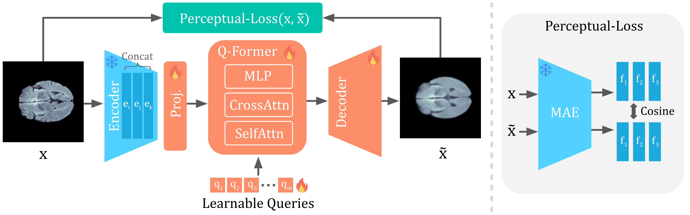

# [WACV 2026] Q-Former Autoencoder: A Modern Framework for Medical Anomaly Detection

[](https://arxiv.org/abs/2507.18481)
[](LICENSE)

Official implementation of the paper **"Q-Former Autoencoder: A Modern Framework for Medical Anomaly Detection"**.



**Abstract** - Anomaly detection in medical images is an important yet challenging task due to the diversity of possible anomalies and the practical impossibility of collecting comprehensively annotated data sets. In this work, we tackle unsupervised medical anomaly detection by proposing a modernized autoencoder-based framework, the **Q-Former Autoencoder (QFAE)**. Our approach leverages state-of-the-art pretrained vision foundation models, such as DINO, DINOv2, and Masked Autoencoder, directly as frozen feature extractors. We introduce a Q-Former architecture as a bottleneck to efficiently aggregate multi-scale features and control reconstruction granularity. Additionally, we incorporate a perceptual loss computed using features from a pretrained Masked Autoencoder to guide reconstruction towards semantically meaningful structures.


## 1. Environment Setup

To set up the environment, please run the following commands:

```bash
conda env create -f environment.yml
conda activate MQ-ViTAE_p312_venv
```

## 2. Dataset Preparation

### Medical Anomaly Detection Benchmark

Download the dataset as described in the [BMAD](https://github.com/DorisBao/BMAD) repository and organize the files according to the structure below:

```text
Dataset_Name/
├── train/
│   └── good/
│       └── img/             # Normal training images
└── test/
    ├── good/
    │   ├── img/             # Normal test images
    │   └── label/           # Black masks (all zeros, optional)
    └── Ungood/
        ├── img/             # Anomalous test images
        └── label/           # Ground truth anomaly masks
```

**Note:** As we discussed in Appendix Liver_CT dataset requires a special preprocessing step. You can use ```preprocess_liver_dataset.py``` script to preprocess Liver_CT dataset

**Expected Directory Structure:**
Ensure your project directory looks like this so the configuration files can locate the data:
```
QFAE/
├── data/
│   ├── Brain/
│   ├── Liver/
│   ├── Chest/
│   ├── RESC/
│   ├── OCT2017/
│   └── ...
├── configs/
│   ├── brain.ini
│   └── ...
├── run_training.py
├── run_test.py
└── ...
```

## 3. Usage

### Training
To train the model on a specific dataset (e.g., Brain MRI), run the following command:

```bash
python run_training.py --config configs/brain.ini
```

### Testing
To evaluate a trained model, ensure the `CHECKPOINT_PATH` in your config file points to your trained `.pth` file, and run:

```bash
python run_test.py --config configs/brain.ini
```

### Pre-trained Models
We provide pre-trained checkpoints for our best models. You can download them from our [Hugging Face repository](https://huggingface.co/ebayar/QFAE-checkpoints) and place them in `results/{Dataset}_AD/checkpoints/` (e.g., `results/Brain_AD/checkpoints/last_ckpt.pth`).

| Dataset | AUROC | Checkpoint |
|---------|-------|------------|
| Brain (BraTS2021) | 94.1% | [brain/last_ckpt.pth](https://huggingface.co/ebayar/QFAE-checkpoints/resolve/main/brain/last_ckpt.pth) |
| Chest (RSNA) | 84.2% | [chest/last_ckpt.pth](https://huggingface.co/ebayar/QFAE-checkpoints/resolve/main/chest/last_ckpt.pth) |
| Liver | 68.4% | [liver/last_ckpt.pth](https://huggingface.co/ebayar/QFAE-checkpoints/resolve/main/liver/last_ckpt.pth) |
| RESC | 91.9% | [retina/last_ckpt.pth](https://huggingface.co/ebayar/QFAE-checkpoints/resolve/main/retina/last_ckpt.pth) |

## License

The source code of **Q-Former Autoencoder** is released under the **MIT License**.

**Note on Data:** The datasets used in this project (BMAD, BraTS2021, RESC, RSNA, etc.) are subject to their own respective licenses (the BMAD benchmark is licensed under **CC BY-NC-SA**).

## Acknowledgements

We gratefully acknowledge the computational resources provided by [TÜBİTAK ULAKBİM High Performance and Grid Computing Center (TRUBA)](https://www.truba.gov.tr/), [METU Center for Robotics and Artificial Intelligence (METU-ROMER)](https://romer.metu.edu.tr/) and [METU Image Processing Laboratory (ImageLab)](https://image.ceng.metu.edu.tr/)

## Citation


```bibtex
@misc{dalmonte2025qformerautoencodermodernframework,
      title={Q-Former Autoencoder: A Modern Framework for Medical Anomaly Detection}, 
      author={Francesco Dalmonte and Emirhan Bayar and Emre Akbas and Mariana-Iuliana Georgescu},
      year={2025},
      eprint={2507.18481},
      archivePrefix={arXiv},
      primaryClass={cs.CV},
      url={https://arxiv.org/abs/2507.18481}, 
}
```
